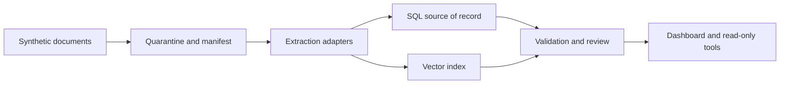

# Tax Vault Public Roadmap

Public-safe roadmap for a local-first tax and financial-document catalog.

This repository intentionally contains no private data and no private implementation secrets. It exists so contributors can help design and build a community version of a source-cited financial document intelligence system.

## Goals

- Local-first financial document catalog.
- PDF extraction with provenance.
- SQL plus vector indexing.
- Tax-year readiness workflows.
- Prompt-injection-resistant document QA.
- Synthetic fixtures only.

## Public-Safe Architecture



The public version should prove the architecture with fake documents and reproducible fixtures. It should not assume access to private storage, private accounts, private tax files, or private deployment environments.

## Non-Goals

- No real user tax files.
- No bank statements.
- No account numbers.
- No secrets.
- No private deployment details.
- No public examples derived from private OCR, embeddings, or screenshots.

## Contributor Workflow

1. Pick a public issue that uses synthetic data.
2. Add or update a synthetic fixture when behavior changes.
3. Include source-citation metadata in outputs.
4. Run public docs validation.
5. State whether the change runs offline.
6. State whether any dependency performs network calls.

## Contribution Areas

- Synthetic tax document fixtures.
- PDF extraction benchmarks.
- Security review checklists.
- Prompt-injection test cases.
- Open-source library reviews.
- Documentation improvements.

## Project Rules

- Public artifacts must use synthetic examples only.
- Every extracted value in future code must resolve to a source citation.
- Every parser proposal must include a license and security review.
- Every AI workflow must treat document content as untrusted data.
- Every public issue should be reproducible without private documents.
- Any accidental private content must be removed immediately and treated as a security incident.

## Synthetic Prototype

A runnable, offline, synthetic-only prototype of the tax-year readiness
workflow now ships in this repo. It reconciles a synthetic W-2 and 1099-NEC
against a synthetic 1040, reports missing-form readiness gaps, and renders a
provenance-cited Markdown report where every value cites its source.

```bash
python -m taxvault.taxreport          # render the readiness report
python -m taxvault.taxreport --json   # machine-readable summary
python -m unittest discover -s tests  # run the tests
```

See `docs/TAX_YEAR_READINESS.md` for details and `docs/TRI_REPO_PARITY.md` for
the shared-core rule that keeps this capability in sync with the sibling repos.

## Validation

Run:

```powershell
python scripts\validate_public_docs.py
```

Public docs should also be scanned before publishing for private names, private endpoints, account-like values, real documents, and secrets.
